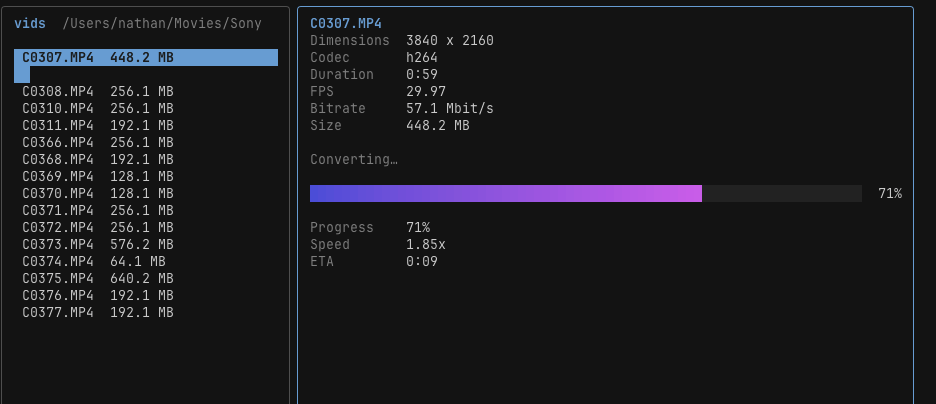

# vids

An interactive terminal tool for resizing video files, built on top of
[ffmpeg](https://ffmpeg.org/). Browse the videos in a folder, inspect their
metadata, pick a smaller resolution, and convert — all from a two-pane TUI.



## Why

I often want to resize or convert a video quickly and *interactively* without
opening some full-fledged video editor. This comes up most when importing
footage from my camera: the files are huge — too big to share over chat or
email — and all I really want is to knock a 4K clip down to 1080p or 720p. `vids`
makes that a few keystrokes in the terminal instead of a trip through heavyweight
software.

## Features

- Two-pane TUI (file list + live metadata) — think a tiny tmux for your videos.
- Arrow-key navigation; non-video files are filtered out automatically.
- Per-file metadata: dimensions, codec, duration, fps, bitrate, size.
- Resize to standard resolutions (1440p / 1080p / 720p / 480p / 360p),
  downscale-only and aspect-ratio preserving, with even dimensions for H.264.
- Quality presets (High / Medium / Small = CRF 18 / 23 / 28); Medium is the default.
- Live progress bar with ETA while encoding.
- Output is written alongside the original with a suffix (e.g. `clip_720p.mp4`) —
  the source is never overwritten.

## Requirements

`vids` shells out to **ffmpeg** and **ffprobe**, so both must be installed and on
your `PATH`. `vids` checks for them at startup and exits with a clear message if
they're missing.

```sh
# macOS
brew install ffmpeg

# Debian / Ubuntu
sudo apt install ffmpeg

# Arch
sudo pacman -S ffmpeg
```

## Installation

### Download a release binary

Grab the archive for your OS/arch from the
[Releases page](https://github.com/nbw/vids/releases), extract it, and put the
`vids` binary somewhere on your `PATH`.

### With Go

```sh
go install github.com/nbw/vids/cmd/vids@latest
```

### Build from source

```sh
git clone https://github.com/nbw/vids.git
cd vids
go build -o vids ./cmd/vids
```

## Usage

```sh
vids            # browse the current directory
vids ~/Movies   # browse a specific directory
vids --version  # print version
```

### Keys

| Context        | Key            | Action                                  |
| -------------- | -------------- | --------------------------------------- |
| Browse         | `↑` / `↓`      | Move between videos                     |
| Browse         | `Enter`        | Select the highlighted video            |
| Browse         | `q`            | Quit                                    |
| Action menu    | `↑` / `↓`      | Move between actions                    |
| Action menu    | `Enter` / `R`  | Choose **Resize**                       |
| Action menu    | `Esc`          | Back to the file list                   |
| Resize         | `↑` / `↓`      | Move between fields (Size / Quality)    |
| Resize         | `←` / `→`      | Change the focused field's value        |
| Resize         | `Enter`        | Confirm & convert (on the confirm row)  |
| Resize         | `Esc`          | Back to the action menu                 |
| Converting     | `Esc`          | Cancel (the partial output is removed)  |

> Convert-to-different-format (codec/container) is on the roadmap; v1 focuses on
> resizing.

## Development

```sh
go test ./...                      # unit tests; the real-conversion test runs
                                   # only if a sample video is present
go build -o vids ./cmd/vids        # build the binary
```

The project is laid out as a standard Go module:

```
cmd/vids/        # main package (CLI entry point)
internal/media/  # ffmpeg/ffprobe wrappers (probe, convert, tool check)
internal/tui/    # Bubble Tea model, views, styles
```

## License

[MIT](LICENSE)
